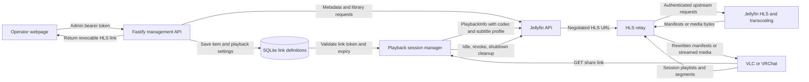

# Request flow

The management API requires the operator's admin token. Playback only requires the generated link token, so third-party players need no cookies or custom headers. Entry-link GET requests share one playback session per link for synchronized group viewing, with bounded server-side segment buffers. All nested manifest references remain on the gateway. Jellyfin owns codecs, subtitle rendering, hardware acceleration, and segment generation; the gateway owns authorization, URL rewriting, transport, and session cleanup.

This is video-on-demand delivery, not a synchronized broadcast. VRChat's world player owns synchronization between participants. The first version does not try to infer watched position from HTTP segment reads or mark items watched.
